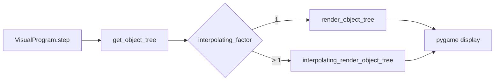
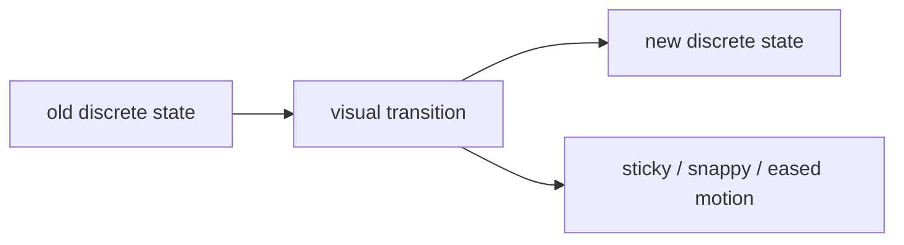
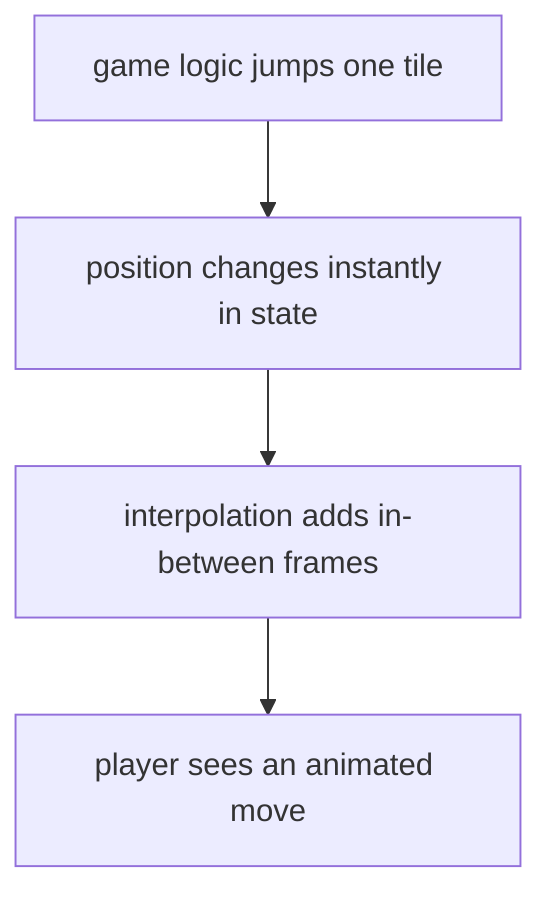
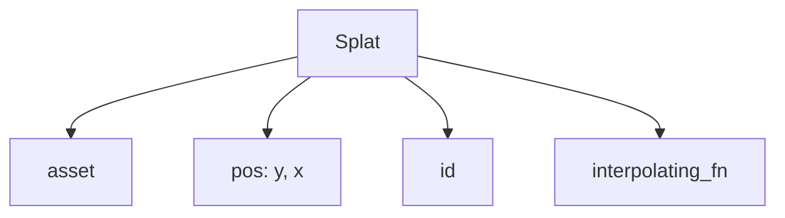
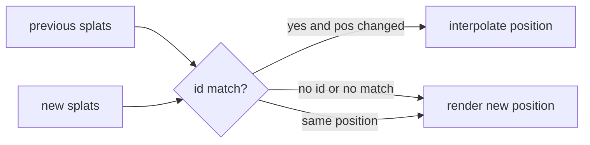
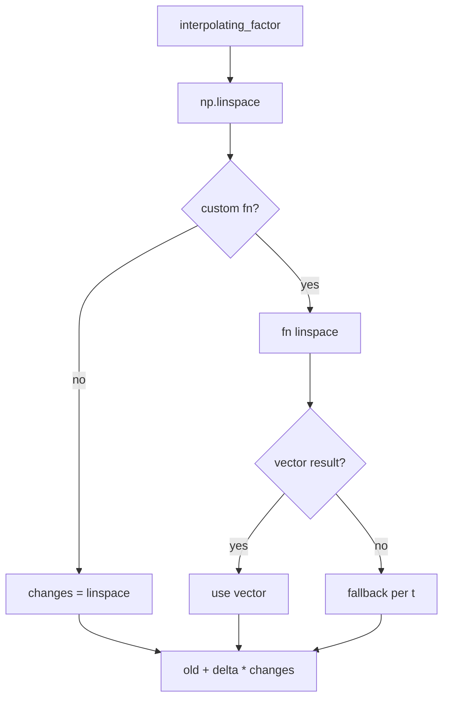
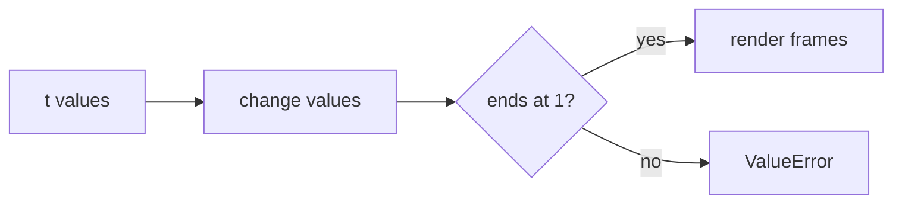
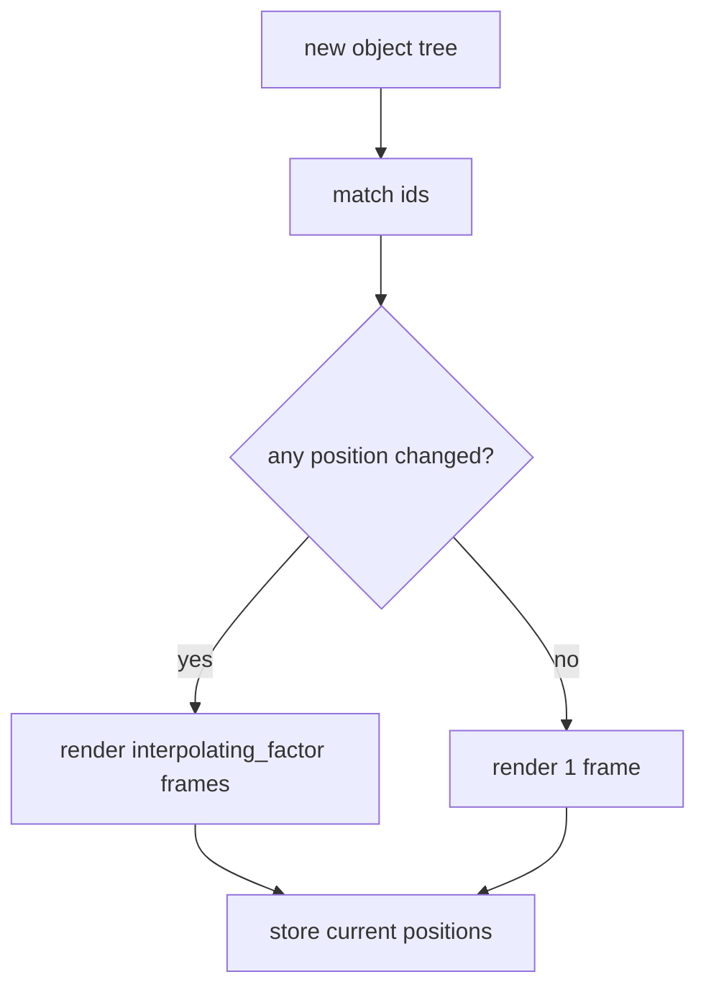

# Interpolation Renderer

The normal renderer draws one object tree directly. The interpolation renderer adds
in-between frames for splats with stable ids, while keeping all drawing logic in
`core/renderer.py`.



## Public API

Use ids on `Splat` objects that should interpolate:

```python
Splat(asset, pos, id="ball")
```

Use `main(..., interpolating_factor=N)` to enable interpolation:

```python
main(visual, interpolating_factor=4)
```

Use a custom easing function when linear interpolation is not enough:

```python
def ease_in_out(t: float) -> float:
    return t * t * (3 - 2 * t)

Splat(asset, pos, id="ball", interpolating_fn=ease_in_out)
```

## Why Non-Linear Interpolation Exists

Non-linear interpolation is useful for discrete-space renders and games. The
simulation state may jump from one grid cell, tile, board position, or logical
state to another, but the visual layer does not have to look like a boring
straight slide.

The interpolation function lets that state jump become a small animation: sticky,
snappy, slow-in, slow-out, overshooting, or otherwise stylized. The object still
begins exactly at the old state and ends exactly at the new state, but the motion
between them can communicate that this is a transition between discrete states
rather than continuous physics.







## Matching

Only splats with ids can interpolate. The renderer stores the previous splat
positions by id, then matches the new tree against that state.



Interpolation affects only position. The asset, color, size, image, and render
order always come from the new object tree.

## Numpy Precalculation

For each render step, positions are precomputed with numpy before drawing starts.
Linear interpolation uses `np.linspace` directly. Custom interpolation functions
are applied to the whole linspace first; if that does not return a vector of the
right shape, the renderer falls back to calling the function per `t`.



The interpolation function must start at `0` and end at `1`. Intermediate values
may go below `0` or above `1`, which is useful for overshoot and shake effects.



See `src/2_interpolation_test` for a simple 8x8 discrete grid where a block jumps
between random cells and uses a sticky overshooting transition.

## No-Motion Fast Path

If no matched splat positions changed, the interpolation renderer skips the extra
frames. It renders one normal frame, stores the current positions, and returns.



This avoids doing work when a simulation step changes state that does not move
anything on screen.
