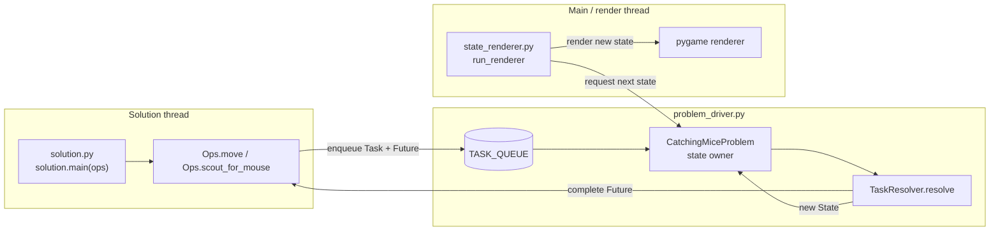
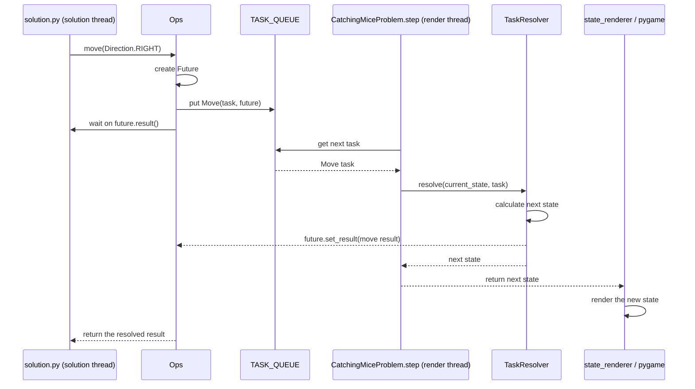
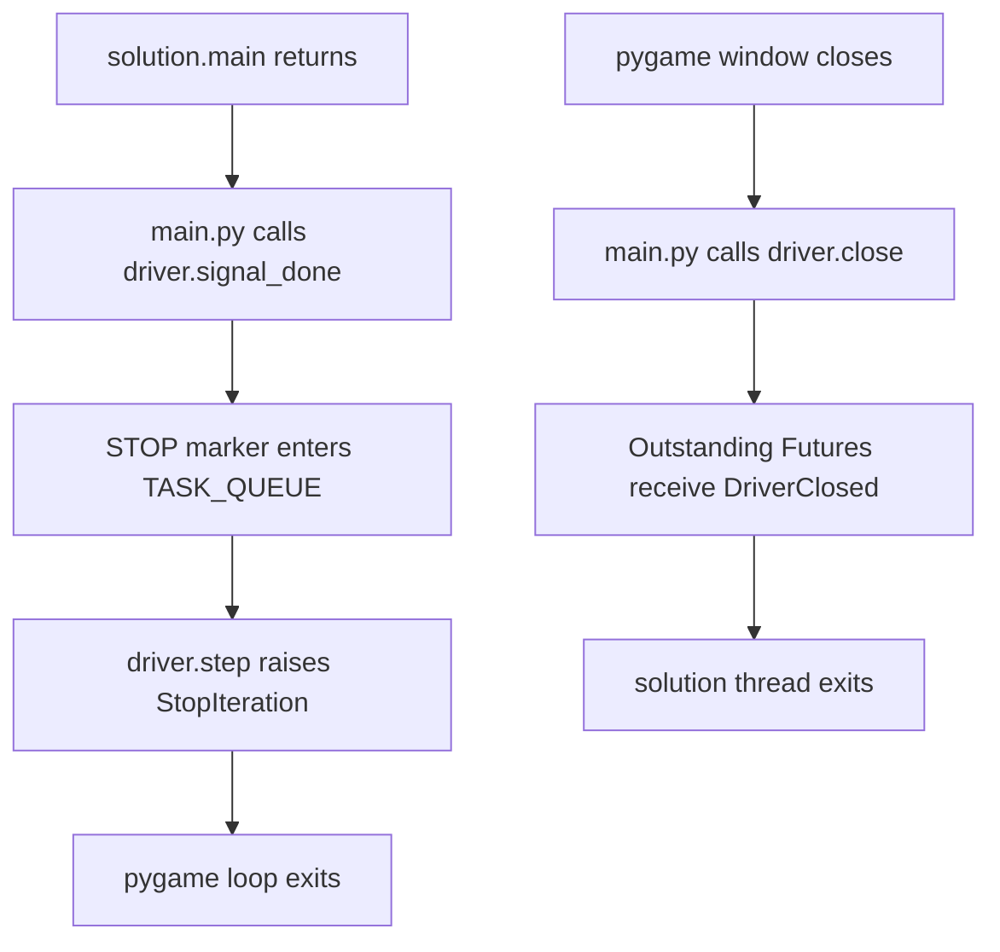

# Grid Robot Architecture

The state is managed by `problem_driver.py`
We have 2 threads:

- `solution.py` (which uses `Ops` to add to `TASK_QUEUE` inside problem_driver and waits on the resolution of added task)
- `state_renderer.py` (`run_renderer`) (which runs `.step` on problem driver, which executes the state change due to the task using `TaskResolver`, which also gives `solution.py` what it was waiting on, and also returns that new state so that `state_renderer` actually renders it

## Ownership and threads

`main.py` creates one `CatchingMiceProblem` and one `Ops` instance. It starts
`solution.main(ops)` in the solution thread, then runs `run_renderer(driver)`
on the main thread, where pygame is allowed to run.

## A task from request to rendered state

Some tasks, such as `ScoutMouse`, can resolve immediately without demanding a
render step. `CatchingMiceProblem.step()` keeps taking and resolving those
tasks until it receives a task that changes state and requires rendering.

## Shutdown

